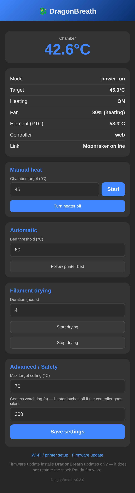

# DragonBreath

Open firmware for the **BIGTREETECH Panda Breath** chamber heater (ESP32-C3),
providing local web control and a selectable control source — **Klipper/Moonraker**
(default), **Home Assistant** (MQTT Discovery), or **Bambu LAN** (experimental).

Sibling to [OpenVent](https://github.com/justinh-rahb/OpenVent) — part of an
open-firmware **family for the BTT Panda line** that shares a common core.
DragonBreath mirrors OpenVent's ESP-IDF + `components/` layout on purpose, so the
shared core (WiFi, captive portal, Moonraker client) is lifted in rather than
re-implemented.

> ⚠️ **Hardware validated on board revisions V1.0.1 and V1.0.** The pin map, sensor
> conversion, and heater/fan actuation were reverse-engineered and validated on a
> V1.0.1 board (82 kΩ Rref — boot, OTA, heat cycle, and the element-foldback
> limiter). The V1.0 board (33 kΩ Rref) has since been **confirmed in the field via
> a user's heat-cycle logs**, including the per-board foldback holding the element
> under the cutoff. Other Panda Breath revisions are untested —
> **verify the pinout against your own board before flashing.** This is community
> firmware with no warranty — read [`docs/SAFETY.md`](docs/SAFETY.md) and
> supervise early runs.

**Docs:** full feature set → [`docs/FEATURES.md`](docs/FEATURES.md) · control API →
[`docs/api-v2.md`](docs/api-v2.md) · safety model → [`docs/SAFETY.md`](docs/SAFETY.md) ·
OEM parity → [`docs/OEM_PARITY.md`](docs/OEM_PARITY.md) · hardware →
[`docs/HARDWARE.md`](docs/HARDWARE.md) · hardware-in-loop testing →
[`docs/HIL.md`](docs/HIL.md).

## Install & update

DragonBreath installs **over the stock firmware as an ordinary app update — no USB,
no full-flash erase.** It ships on the **stock partition layout**, so the factory
bootloader and the stock app in the *other* OTA slot stay in place: installing is
just uploading the DragonBreath app image from the stock web UI, and the stock image
is still sitting there to go back to.

> 💾 **Back up your stock firmware first — strongly recommended.** BIGTREETECH does
> **not** publish stock images. Installing over stock leaves the factory image in the
> *inactive* OTA slot, so you can flip back to it with **Settings → Boot inactive
> slot** — but only until you later OTA-update DragonBreath, which overwrites that
> slot with the previous DragonBreath version. A USB backup is the durable,
> always-available way home. Take one and copy it somewhere safe before you start:
> ```bash
> python3 tools/flash.py --backup-only        # verified full stock backup, no flashing
> ```
> This talks to the board over the on-board CH340K USB-C bridge (native USB is
> unavailable — GPIO18 is the SSR).

**Install (stock → DragonBreath), no USB needed:**
1. Download `dragonbreath-<ver>.bin` from a [release](../../releases) — or build it
   (`idf.py build` → `build/dragonbreath.bin`). Optionally verify it against the
   release `SHA256SUMS.txt`. Each release also ships a `manifest.json` (source SHA,
   ESP-IDF version, vendored-core provenance + per-artifact SHA-256).
2. Open the **stock** Panda web UI and use its **Firmware Update** to upload that
   `.bin`. Stock writes it to the inactive OTA slot and reboots into it.
3. DragonBreath comes up and **rejoins your WiFi automatically** — it carries the WiFi
   credentials (and the Moonraker host) over from the stock firmware's stored config on
   first boot, so there's normally nothing to re-enter. If it can't join (e.g. you've
   since changed networks), connect to the **`DragonBreath_XXXX`** AP (password
   **`987654321`**, same as the stock Panda) and a browser should pop the setup page
   automatically (or open `http://192.168.4.1`).

> ⚠️ **Don't hold a front-panel button while powering the board on.** Power, Auto,
> and Dry sit on ESP32-C3 strapping pins (GPIO9 is ROM download-mode); a held
> button pulls its strap low at reset and the board won't boot normally.
> DragonBreath also ignores any button already down at power-on until you release
> it. On (GPIO10) is the only button on a non-strapping pin.

**Updating DragonBreath:** open the **Firmware update** link on the status page (the
`/fw` page) and upload the new `dragonbreath-<ver>.bin` (or `build/dragonbreath.bin`).
It lands in the inactive OTA slot, is verified, and the device reboots into it; a bad
image rolls back on the next boot. Updates are refused while the heater is on.

**Reverting to stock — boot back to Panda:** because DragonBreath installs *alongside*
the factory image (the stock app stays in the other OTA slot), the fastest way back is
to just boot it — no flashing, nothing erased:

<p></p>

1. Open the dashboard **Settings** tab and scroll to **Maintenance**. The **Inactive
   slot** row names what will boot — e.g. *stock Panda 1 — your way back to stock*.
2. Turn the heater off (the action is refused while heating), then click **Boot
   inactive slot** and confirm. The device flips the boot pointer and reboots into the
   stock firmware.

This works until you've OTA-updated DragonBreath at least once, after which the
inactive slot holds the *previous DragonBreath* instead of stock. So a **USB backup
stays your durable way home** — and web OTA also accepts a stock `panda_breath` image,
so you can re-flash your saved backup over WiFi from the `/fw` page (refused while the
heater is on).

**USB is recovery-only.** `tools/flash.py` remains for taking a full stock backup
(`--backup-only`), restoring one, or unbricking a board that won't boot:
```bash
python3 tools/flash.py --backup-only                                 # save a stock backup
python3 tools/flash.py --restore backups/stock-YYYYmmdd-HHMMSS.bin    # full USB restore
```

## Status
| Component | State |
|---|---|
| `pb_board` | ✅ Pinout RE'd; boots on hardware (V1.0.1/82k on our bench; V1.0/33k confirmed in the field) |
| `pb_ntc` | ✅ Stock conversion ported; **hardware-validated** (reads chamber temp matching the printer); Rref auto-detected per board (82k V1.0.1 / 33k V1.0) with a dual-pull fail-safe |
| `pb_heater` | ✅ Bang-bang + full safety cutoffs + per-board element foldback; heat cycle and foldback validated on hardware |
| `pb_fan` | ✅ TRIAC **on/off held-gate** (stock model — the gate is never PWM'd/phase-chopped) |
| `pb_policy` | ✅ Authoritative mode/target/lease state machine |
| Network core: `dc_wifi` / `dc_evlog` / `dc_moonraker` | ✅ Consumed from pinned [`dragon-core`](https://github.com/justinh-rahb/dragon-core) components (derived in part from OpenVent, MIT — see [VENDORING.md](VENDORING.md)); WiFi + Moonraker validated on hardware |
| Portal / status dashboard | ✅ Captive provisioning + v2 dashboard (manual / auto / dry / advanced cards, SSE-driven) |
| Status LEDs (`pb_leds`) | ✅ All four driven from policy: Power = device-alive/fault, On/Auto/Dry = active mode (Auto slow-blinks when armed but waiting). |
| Front-panel buttons (`pb_buttons`) | ✅ All four polled with debounce + short/long-press; short toggles the labeled mode, 2 s long-press = panic-off (Power-long while faulted = fault clear). Real-Panda + devboard-HIL benches passed. |
| HTTP control API (`pb_httpd`) | ✅ API v2 (JSON command/state + SSE, CSRF-gated) — shipped in v0.3.0 |
| Klipper-side helper (M141 / Fluidd) | ✅ [dragonbreath-klipper](https://github.com/plastikman/dragonbreath-klipper): `[heater_generic dragonbreath]` (M141/M191) + `[output_pin dragonbreath_filter]` (fan-only filtration toggle); API v2, deploy lockstep with the firmware |
| Filament-dry mode | ✅ Timed dry with material presets; validated end-to-end on hardware |
| Auto (follow-bed) mode | 🚧 Shipped in the state machine + UI; end-to-end hardware soak in progress |
| Fan-only filtration | ✅ Standing fan-only band (`filter_temp`, opt-in/**off by default**) — runs on the bed setpoint independent of mode (stock-shaped) + mode-independent manual `filter` control (dashboard + API); idle-only to enable |
| Install / revert | ✅ **No-USB**: installs over stock as an app-only OTA (stock partition layout); revert via **Boot inactive slot** or by re-uploading a stock image over web OTA |
| Flasher (`tools/flash.py`) | ✅ Recovery/backup tool: `--backup-only` saves a verified full stock backup, `--restore` writes one back, default path unbricks over USB |
| Web OTA update | ✅ Dual-OTA + rollback; upload from the UI, verified on hardware — accepts a DragonBreath **or** a stock `panda_breath` image (for revert); refused while heating |
| HIL (`pb_hil` / `tools/hil.py`) | ✅ CH341 devboard suite and non-heating real-Panda UART build/flash/no-flash workflows qualified on hardware; native-USB runtime pending on the tested devboard |
| Control source (`dc_source`/`dc_bambu`/`pb_ha`) | ✅ Single-select on `/setup` (mutually exclusive): Klipper/Moonraker (default, validated) · Home Assistant MQTT Discovery (validated on live HA) · Bambu LAN MQTT (experimental, untested on real hardware) |
| On-device diagnostics pages | ✅ `/diag` (live SSE telemetry + trend + CSV) and `/console` (firmware `ESP_LOGx` viewer via auth-gated `GET /api/v2/console`) — shipped v0.8.0 |
| Diagnostics (`tools/diag.py`) | ✅ Read-only 2 Hz logger (chamber/PTC/SSR/mode/fault + resolved Rref) → live view + CSV; run during a heat cycle to capture behavior. `python3 tools/diag.py [host] [token]` |

**Shared-core boundary:** board-agnostic infrastructure is consumed from the pinned
[`dragon-core`](https://github.com/justinh-rahb/dragon-core) revision declared in
[`main/idf_component.yml`](main/idf_component.yml). The editable dashboard SPA is
supplied by dragon-core's `dc_ui`; DragonBreath keeps the board map, sensors,
heater/fan actuation, safety policy, product-specific API handlers, setup/OTA portal,
LEDs, and buttons.
The OpenVent-to-DragonBreath-to-dragon-core history and MIT provenance are recorded in
[VENDORING.md](VENDORING.md).

## Chamber temperature — what to expect
The stock Panda firmware caps the chamber target at **60 °C**. **DragonBreath lifts
this to 70 °C.** Reaching the top of that range is **possible, not guaranteed** —
**65 °C is readily achievable** on a typical enclosure, and 70 °C is within reach
given the right conditions. The limiting factor is your **enclosure insulation and
time**, not the firmware. The PTC element is self-limiting and the firmware folds
heater power back below its safety cutoff, so once the element saturates the chamber
only climbs as fast as the enclosure can hold the heat. A well-sealed, insulated
chamber given enough soak time will reach higher and hold it; a leaky one (taped
seams, thin panels) plateaus lower no matter how long it runs. If you're stalling
short of a target, add insulation and allow more warm-up time before assuming a
hardware limit. 60–65 °C covers ASA/ABS comfortably.

## Screenshots
<p>



</p>

The responsive, touch-first web UI, served by the device itself over plain HTTP on
your LAN and embeddable in the Fluidd / Mainsail panel: the live **dashboard**
(chamber / PTC temperature, trend, and quick controls incl. a **Filtration**
fan-only toggle), **automatic** mode (arm a chamber target that follows the printer
bed, with an optional fan-only filtration band below the heat threshold), a timed
filament-**drying** cycle with material presets, and **settings** (safety limits,
comms watchdog, foldback cut, filtration temperature, and ±5 °C sensor
calibration). Setup (`/setup`, Wi-Fi + control-source selector), OTA (`/fw`), a live
**`/diag`** telemetry page (chamber/PTC/SSR/mode/fault + trend + CSV export over SSE),
and a **`/console`** firmware-log viewer all share the same theme. Both **light and
dark** themes are built in (auto / light / dark toggle), and the layout stacks
vertically on phones while keeping the full layout on desktop.

## Hardware
ESP32-C3-MINI-1, mains PSU, PTC heater via SSR (GPIO18), ~220 VAC blower switched
by a **TRIAC held on/off** (GPIO3 gate + GPIO7 zero-cross — **never** phase-angle
PWM'd), two NTCs on ADC1. Full map: [`docs/HARDWARE.md`](docs/HARDWARE.md).
Reverse-engineered and validated on a **V1.0.1** board (82 kΩ Rref); the **V1.0**
board (33 kΩ Rref) is confirmed in the field via a user's heat-cycle logs.

## Safety
Two independent **hardware** over-temp backstops (a bonded thermal cutoff in the
PTC mains lead + PTC self-limiting physics) bound the worst-case failure to
roughly the stock firmware's ceiling — they are not defeated by a firmware bug or
a welded SSR. This firmware adds soft cutoffs + a comms-loss watchdog on top,
including a fixed **105 °C PTC-element cutoff** that latches a fault (and survives a
power-cycle). Below that, a per-board **element-temperature foldback** cuts the SSR
with hysteresis to hold the element *under* the hard cutoff instead of tripping it —
so a hot or poorly-insulated install keeps warming the chamber rather than falling
into a "clear → trip again" loop. The foldback cut point is per-Rref (99 °C on
33 kΩ / V1.0, 102 °C on 82 kΩ / V1.0.1) and user-adjustable within **90–104 °C**
(**Settings → Foldback cut**); it can only *reduce* heater demand and can never
exceed 104 °C, so it cannot defeat the hard cutoff. No firmware can *guarantee* the
absence of a fault; read [`docs/SAFETY.md`](docs/SAFETY.md) before touching heater
code and supervise the device.

## Control sources
DragonBreath binds to **one** controller at a time, chosen on the **setup** page
(`/setup`, and the AP captive portal) under **Control source**. Pick one and the
others are disabled — there is exactly one controller.

| Klipper / Moonraker | Bambu (LAN) | Home Assistant |
|:---:|:---:|:---:|
|  |  |  |

- **Klipper / Moonraker** — *first-class; the primary target.* With the
  [dragonbreath-klipper](https://github.com/plastikman/dragonbreath-klipper) helper it
  shows up as `[heater_generic dragonbreath]` (M141/M191) plus a fan-only filtration
  toggle, and AUTO mode follows the printer bed. Validated end-to-end on hardware.
- **Home Assistant** — *first-class.* Native MQTT Discovery: the device advertises a
  climate entity plus chamber/element sensors, takes setpoint/mode commands over MQTT,
  and publishes retained state. Validated against a live Home Assistant instance.
- **Bambu (LAN)** — *experimental — **testers wanted.*** A LAN-MQTT client that follows
  a Bambu printer's bed/chamber the way AUTO follows Moonraker. It is wired up and
  builds, but has **not been tested on a real Bambu printer** (we don't have one). If
  you can help, please [open an issue](../../issues) with logs from an actual Bambu
  setup — that's what it needs to graduate from experimental.

## Control API & access
`pb_httpd` exposes the versioned HTTP/JSON API on port 80:

| Method | Path | Purpose |
|---|---|---|
| GET | `/api/v2/info` | device identity, boot identity, firmware, capabilities, and `rref_kohm` (82/33) |
| GET | `/api/v2/state` | complete authoritative state snapshot — **no** side effects |
| GET | `/api/v2/events` | SSE stream of state transitions and telemetry snapshots |
| GET | `/api/v2/health` | uptime, heap, Wi-Fi signal/channel, SSE client count |
| GET | `/api/v2/logs` · `/api/v2/calibration` | event ring; sensor-calibration offsets + live readings |
| GET | `/api/v2/console` | **auth-gated** `text/plain` firmware `ESP_LOGx` ring snapshot (backs the `/console` page) |
| POST | `/api/v2/command` | revision-aware OFF / POWER_ON / AUTO / DRYING / **FILTER** / fault-clear command |
| POST | `/api/v2/heartbeat` | refresh exactly the device-issued active lease |
| POST | `/api/v2/restart` · `/factory-reset` · `/boot-inactive` | maintenance: reboot, wipe to AP provisioning, boot the inactive OTA slot (revert to stock) |
| GET/POST | `/settings` · `/api/v2/calibration` · `/api/v2/token` | runtime knobs + bounds (max target, comms watchdog, `cool_release`, `fb_cut`, `filter_temp`/`filter_auto`, LEDs); ±5 °C calibration; control token |
| POST | `/update` | authenticated app-image OTA — accepts a DragonBreath **or** stock `panda_breath` image (revert); refused while heating |

The alpha `/status`, `/target`, `/heartbeat`, and `/reset` routes are removed.
Remote POWER_ON returns a device-issued lease; only an exact lease heartbeat can
keep that session alive. Stale revisions cannot overwrite newer control state,
while OFF is intentionally unconditional. See [`docs/api-v2.md`](docs/api-v2.md)
for the wire contract.

Every **mutating** endpoint (and the portal's STA-mode `/save`) requires a custom
`X-DragonBreath-Auth` header. A cross-origin HTML form can't set a custom header and
CORS is never enabled, so an ordinary drive-by web page can't drive the heater or
rewrite the WiFi config. This is **CSRF hardening for a trusted LAN, not transport
security** — the API is unencrypted HTTP. For untrusted networks, set a control
token in NVS (`app_nvs` / `ctl_token`) and the header must match it exactly. The
token is **never embedded in the served pages**: when one is configured the
dashboard prompts for it and caches it in the browser (localStorage), so it is
real per-client auth rather than a value baked into public HTML. With no token
configured, pages use a fixed `web` sentinel (pure CSRF hardening).

## Show the dashboard in Fluidd / Mainsail
The dashboard embeds directly in the Fluidd/Mainsail printer view as an **iframe
"camera."** Moonraker's `[webcam]` section supports an `iframe` service that renders a
URL instead of a video stream — point it at the DragonBreath device and the dashboard
shows up as a tile. This is **not** a video stream; `service: iframe` embeds the page
itself (no `target_fps`, no snapshot).

Add this to your Moonraker config. On the Snapmaker U1 extended firmware it goes in
`printer_data/config/extended/moonraker/99_dragonbreath.cfg`; on other setups use
`moonraker.conf` (or any included `.cfg`):

```ini
[webcam dragonbreath]
enabled: true
service: iframe
# Full URL to the DragonBreath DEVICE (a separate box from the printer). Prefer its
# static-DHCP IP; dragonbreath.local only works if mDNS resolves reliably.
stream_url: http://dragonbreath.local/
aspect_ratio: 4:3
```

Notes:
- **`stream_url` must be a full `http://…` URL to the device**, not a relative path
  (a relative path resolves against the printer host, not the ESP32).
- **Serve Fluidd/Mainsail over `http`.** An `https` UI blocks the DragonBreath `http`
  iframe (browser mixed-content) — the usual blank-tile cause.
- No `snapshot_url` is needed — the dashboard has no snapshot endpoint (it only means no
  selector thumbnail).
- On a **touch** device the tile collapses to the compact/stacked layout automatically;
  on desktop it keeps the full layout, so give the tile a reasonable size (`4:3` matches
  the dashboard's proportions).
- If a device **control token** is set, the embedded page prompts for it before controls
  work; read-only viewing needs nothing.

## Temperature conversion
Fully reverse-engineered from the stock firmware — a low-side resistance divider
(`Rntc = Rref·V / (Vsupply − V)`, `Vsupply = 3.3 V`) feeding a 114-entry R/T lookup
table, not a beta formula. `Rref` is **auto-detected per board** from the Rref strap
— **82 kΩ** on V1.0.1, **33 kΩ** on V1.0 — read once at boot with a dual-pull check
that fails safe to the conservative value if the strap floats. The same R/T table
serves both boards. Details + derivation:
[`docs/NTC_CONVERSION.md`](docs/NTC_CONVERSION.md).

## Build
Requires ESP-IDF v5.3+.
```bash
git clone https://github.com/plastikman/DragonBreath
idf.py set-target esp32c3
idf.py build
```

## Layout
```
components/
  pb_board/    GPIO single-source-of-truth
  pb_ntc/      ADC -> temperature (RE'd stock conversion)
  pb_heater/   SSR control + safety cutoffs + comms watchdog
  pb_fan/      TRIAC on/off held-gate blower control (never PWM)
  pb_policy/   authoritative control state, modes, leases -> actuators
  pb_ha/       Home Assistant MQTT-Discovery client (source + controller)
  pb_leds/     front-panel status LEDs
  pb_buttons/  front-panel button poll/debounce + short/long-press
  pb_hil/      JSON serial HIL console + safe dev-board injection
  pb_httpd/    HTTP control API (CSRF-gated mutations) + /console log ring
  pb_portal/   captive-portal + control-source setup + dashboard/diag/console pages
main/          app_main: safety-first init + control loop
docs/          hardware map, safety model, HIL guide, NTC RE report
```

Managed components fetched from `dragon-core` are `dc_evlog`, `dc_source`,
`dc_bambu`, `dc_wifi`, `dc_moonraker`, and `dc_ui`; they are not stored under this
repository's `components/` directory.

## Credits
Hardware + firmware reverse-engineering builds on the BTT Panda Breath work in
this project's `klipper-esp32` history and the OpenVent architecture
([justinh-rahb](https://github.com/justinh-rahb)). MIT licensed.

## Support
If DragonBreath is useful to you, you can support development here:

[](https://buymeacoffee.com/plastikman)
[](https://www.paypal.com/donate/?business=MPMX47RUYQFKJ&no_recurring=1&currency_code=USD)
