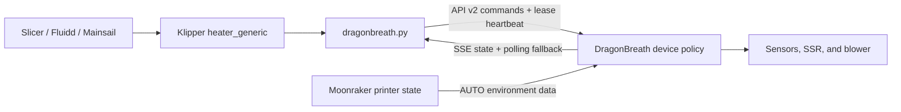

# Integrating DragonBreath into a Klipper firmware distribution

This guide is for maintainers who want DragonBreath to behave like a native
chamber heater in a Klipper-based printer firmware. It describes the stable
host integration used by
[`dragonbreath-klipper`](https://github.com/plastikman/dragonbreath-klipper) and
the packaging and lifecycle lessons from
[Snapmaker U1 Extended Firmware PR #626](https://github.com/paxx12-snapmaker-u1/SnapmakerU1-Extended-Firmware/pull/626).

The normal integration is deliberately small:

1. Package the `dragonbreath.py` Klippy extra.
2. Provide an inactive configuration example.
3. Have the user flash and provision DragonBreath, set its address in the
   configuration, include the file, and restart Klipper.

Automatic stock-firmware conversion, device discovery, configuration binding,
and bundled device firmware are optional distribution features. They are not
requirements for DragonBreath support and should not be copied from the U1
integration unless the target project actually owns that migration problem.

## System model

DragonBreath is not a remote PWM board. The device remains the authoritative
heater controller and enforces its own target clamp, sensor checks, element
foldback, over-temperature faults, cooldown airflow, and communications-loss
watchdog. Klipper supplies intent and presents the device through standard
Klipper objects.



There are two independent network relationships in Klipper control-source mode:

- The Klippy helper connects directly to DragonBreath over HTTP API v2. This is
  the path used for `M141`, `M191`, heater state, fault state, and the filtration
  output.
- DragonBreath connects to Moonraker to observe printer state used by its
  autonomous modes, such as following the loaded filament profile. The printer's
  Moonraker address is configured on the DragonBreath setup page.

No MQTT broker, Moonraker plug-in, or special Moonraker configuration is
required for the native Klippy-extra path.

### AUTO and manual G-code are alternative workflows

The helper's Python file can be installed while DragonBreath AUTO is used, but its
active `[dragonbreath]` configuration is a manual controller. As required below,
it sends a safety OFF on connect, orderly disconnect, and Klippy shutdown; a
reconnect can therefore disarm AUTO. Slicer-issued `M141`, `M191`, and
`SET_HEATER_TEMPERATURE` commands with a positive target also start a manual
POWER_ON session and replace AUTO. A distribution should provide a way to disable the active helper config,
tell users to choose one workflow, and link to
[`USING_THE_HEATER.md`](USING_THE_HEATER.md).

OrcaSlicer deserves an explicit warning. With chamber-temperature control enabled,
it emits a blocking `M191` before Machine start G-code. The usual bed command has
not run yet, so warm-up is sequential. For simultaneous bed/chamber warm-up, disable
Orca's injected command, pass its chamber value to `PRINT_START`, start the bed and
chamber non-blocking, and then wait for each inside the printer macro.

## Responsibilities and safety boundaries

### DragonBreath firmware

The device must:

- boot with heating off and never restore an active heating lease after reboot;
- treat its complete API v2 state as authoritative;
- issue a private lease ID when accepting `power_on`;
- accept heartbeats only for that exact active lease;
- latch off when the lease expires or another safety condition trips;
- allow an unconditional `off`, even when the caller has a stale revision;
- reject unsupported API versions and unsafe state transitions; and
- enforce all physical limits independently of Klipper.

See [the safety model](SAFETY.md) and [API v2](api-v2.md). Host software must not
attempt to reproduce or weaken these rules.

### `dragonbreath-klipper`

The helper must:

- expose `sensor_type: dragonbreath` and the virtual
  `dragonbreath:pwm` heater pin;
- expose the on/off-only `dragonbreath:filter` pin;
- perform **all network I/O outside Klipper's reactor thread**;
- send revision-aware, idempotent API v2 commands;
- retain and heartbeat only the lease returned to its own accepted `power_on`;
- consume SSE state with serialized polling as a fallback;
- accept physical-panel, Web UI, safety, or other-controller overrides without
  silently restoring an old target;
- request unconditional off on connect, orderly disconnect, and Klippy shutdown;
  and
- fail safe on protocol mismatch or missing private lease.

The communications watchdog on the device—not successful delivery of an HTTP
`off` request—is the final protection when Klipper or the network disappears.

### The printer distribution

The distribution owns packaging and lifecycle, not heater policy. It must:

- install a tested, pinned helper revision before an active `[dragonbreath]`
  section can be parsed;
- preserve user connection settings during system updates;
- restart the Klipper **process** after adding or replacing a Klippy extra;
- keep device and helper compatibility explicit in release metadata; and
- provide a downgrade or disable path that removes the active configuration
  before removing the helper.

## Minimum supported integration

### 1. Pin and install the helper

Use a commit SHA or a released source archive. Do not fetch `main` on the printer
at boot or install time. Image-based distributions should copy
`dragonbreath.py` into their packaged Klipper tree; mutable installations may
use the upstream `install.sh`.

The required destination is the `klippy/extras` directory used by the running
Klipper instance. Common examples are:

- checkout installation: `~/klipper/klippy/extras/dragonbreath.py`
- image/package installation: `/usr/share/klipper/klippy/extras/dragonbreath.py`

The helper uses only the Python standard library. It requires DragonBreath API
v2 and intentionally does not probe or fall back to the removed alpha API.

### 2. Give the user an inactive configuration example

This is the upstream baseline:

```ini
[dragonbreath]
host: 192.168.1.100
#port: 80
#token: web
#poll_interval: 2.0
#register_macros: True

[heater_generic dragonbreath]
heater_pin: dragonbreath:pwm
sensor_type: dragonbreath
control: watermark
max_delta: 2.0
min_temp: 0
max_temp: 75

[verify_heater dragonbreath]
check_gain_time: 300
hysteresis: 5
heating_gain: 1

[output_pin dragonbreath_filter]
pin: dragonbreath:filter
```

Important details:

- The `[dragonbreath]` suffix and `[heater_generic dragonbreath]` suffix must
  match.
- The device currently hard-caps the requested chamber target at 70 °C. The
  Klipper `max_temp: 75` leaves validation headroom; it does not raise the device
  limit. Do not issue `M191` above the device's effective maximum: the wait cannot
  complete for a temperature the device will never target.
- `token` must match the control token configured on DragonBreath. Its default
  value is the `web` CSRF sentinel, not transport security. Use an isolated,
  trusted printer LAN when the API is served over plain HTTP.
- `poll_interval` controls fallback polling and retry cadence. SSE remains the
  normal state path.
- The blower is binary hardware behind a zero-cross TRIAC. Expose it as an
  `output_pin`, not a variable-speed fan. Any non-zero command means fully on.
- The device may reject turning filtration on while heating or performing a
  cooldown purge. Turning it off remains allowed.

By default the helper registers `M141` and `M191`. Set
`register_macros: False` only when the distribution supplies those commands
itself. If it does, preserve their standard behavior:

```ini
[gcode_macro M141]
description: Set chamber temperature (DragonBreath)
gcode:
    
    SET_HEATER_TEMPERATURE HEATER="dragonbreath" TARGET={s}

[gcode_macro M191]
description: Set chamber temperature and wait (DragonBreath)
gcode:
    
    SET_HEATER_TEMPERATURE HEATER="dragonbreath" TARGET={s}
    
        TEMPERATURE_WAIT SENSOR="heater_generic dragonbreath" MINIMUM={s}
    
```

Unlike the Moonraker-MQTT fallback integration, this helper creates a real
Klipper sensor object. `M191` can therefore use Klipper's normal blocking
temperature wait.

### 3. Make activation explicit

A conservative user flow is:

1. Flash and provision the DragonBreath device.
2. Select **Klipper / Moonraker** as its control source and configure the
   printer's Moonraker address on the device.
3. Give the device a stable DHCP lease or resolvable hostname.
4. Copy the distribution's example to the user configuration directory.
5. Set `host` and, if configured, `token`.
6. Add `[include dragonbreath.cfg]` to `printer.cfg`.
7. Restart the Klipper process.

Do not enable a packaged example automatically with a placeholder address. An
unreachable heater object is confusing, and removing its backing Python module
while its config remains active prevents Klipper from starting.

### 4. Expose normal Klipper controls

After restart, the integration provides:

- a `dragonbreath` chamber heater in Fluidd and Mainsail;
- `M141 S<temperature>` and `M191 S<temperature>`;
- `SET_HEATER_TEMPERATURE HEATER=dragonbreath TARGET=<temperature>`;
- `SET_PIN PIN=dragonbreath_filter VALUE=0|1`;
- `DRAGONBREATH_RESET` for a recoverable latched device fault; and
- a `printer.dragonbreath` status object for macros and dashboards.

Useful status fields include `connected`, `temperature`, `target`,
`device_target`, `ptc_temp`, `heating`, `heater_demand`, `fault`, `inhibited`,
`fault_reason`, `mode`, `source`, `state_revision`, `firmware_version`,
`lease_owned`, `fan_percent`, `fan_reason`, and `protocol_error`.

## Packaging patterns

### Mutable Klipper installations

For conventional Linux installations, the upstream installer can symlink or
copy the module and restart a named systemd service:

```sh
./install.sh --klipper-dir /path/to/klipper --service klipper
```

If Moonraker manages third-party components, the distribution may also document
the upstream `[update_manager dragonbreath-klipper]` block. Do not add a second
update mechanism when the printer firmware already owns package updates.

### Immutable or image-built distributions

Treat the helper as an ordinary package:

- pin the source and verify its license at build time;
- install a regular file, not a symlink into a build checkout;
- declare a runtime dependency on the distribution's Klipper provider;
- install the example outside any automatically included config directory;
- add the package to the image manifest; and
- update it only through the distribution's normal image/update channel.

Keep the connection file user-owned. A distribution with a mature managed-config
system may split it into:

- a small user file containing `[dragonbreath]`, `host`, `token`, and an include;
- a read-only managed fragment containing the heater, verifier, filtration pin,
  and optional macros.

That split is useful when managed tuning must evolve without overwriting the
user's address or token. It is not necessary for a first integration; shipping
the upstream combined example is simpler.

## COSMOS implementation sketch

[OpenCentauri COSMOS](https://github.com/OpenCentauri/cosmos) is a Yocto image.
At the time this guide was written, its Kalico recipe installs Klippy under
`/usr/share/klipper`, user configuration under `/etc/klipper/config`, and starts
Klipper with SysV init. Its existing AFC add-on recipe demonstrates the supported
pattern for adding files to `klippy/extras`.

For a deliberately low-touch COSMOS integration, add a package such as:

```bitbake
# meta-opencentauri/recipes-data/dragonbreath-klipper/dragonbreath-klipper_git.bb
SUMMARY = "DragonBreath chamber-heater integration for Klipper"
HOMEPAGE = "https://github.com/plastikman/dragonbreath-klipper"
LICENSE = "MIT"
LIC_FILES_CHKSUM = "file://LICENSE;md5=ff1231f0087400bc406945200e2f0ef0"

SRC_URI = "git://github.com/plastikman/dragonbreath-klipper.git;protocol=https;branch=main"
# Update deliberately after testing the helper against the device firmware
# shipped or documented by this COSMOS release.
# This reference pin includes filtration control and requires DragonBreath
# firmware >= 0.6.5; use a current stable device release.
SRCREV = "88a6dacf5d8cc692fb5c5a4c508325f5f82b0cce"
S = "${WORKDIR}/git"

RDEPENDS:${PN} = "klipper"

do_configure[noexec] = "1"
do_compile[noexec] = "1"

do_install() {
    install -d ${D}${datadir}/klipper/klippy/extras
    install -m 0644 ${S}/dragonbreath.py \
        ${D}${datadir}/klipper/klippy/extras/dragonbreath.py

    # Deliberately inactive: the user copies and edits this file when enabling
    # the device. Do not install it into a wildcard-included config directory.
    install -d ${D}${datadir}/dragonbreath-klipper
    install -m 0644 ${S}/config/dragonbreath.cfg \
        ${D}${datadir}/dragonbreath-klipper/dragonbreath.cfg
}

FILES:${PN} = " \
    ${datadir}/klipper/klippy/extras/dragonbreath.py \
    ${datadir}/dragonbreath-klipper/dragonbreath.cfg \
"
```

Add `dragonbreath-klipper` to `CORE_IMAGE_EXTRA_INSTALL` in
`meta-opencentauri/images/opencentauri-image-base.bb`.

The user-facing COSMOS setup can remain four commands plus an edit:

```sh
cp /usr/share/dragonbreath-klipper/dragonbreath.cfg \
   /etc/klipper/config/dragonbreath.cfg
# Edit /etc/klipper/config/dragonbreath.cfg and set host/token.
# Add this line to /etc/klipper/config/printer.cfg:
# [include dragonbreath.cfg]
/etc/init.d/klipper restart
```

This intentionally does **not** add a COSMOS setting, conversion wizard, network
scan, automatic binding, or device-firmware updater. If COSMOS later wants an
enable switch, its existing `config-manager` and generated `zextras.cfg` mechanism
can conditionally include a managed fragment, but that is an optional UX layer
over the same package.

Before submitting a COSMOS change, confirm the current Kalico provider, install
paths, image recipe, and init system; those are distribution implementation
details and may change independently of DragonBreath.

## Versioning and update policy

Track three independently versioned artifacts:

| Artifact | Owner | Compatibility concern |
|---|---|---|
| DragonBreath device firmware | DragonBreath release | API version and capabilities |
| `dragonbreath.py` | `dragonbreath-klipper` revision | API contract and Klipper/Kalico compatibility |
| Distribution config/package | Printer firmware project | Paths, macro ownership, update and rollback behavior |

For every printer-firmware release:

1. Pin the helper revision rather than following a branch at runtime.
2. State the minimum tested DragonBreath version in release notes.
3. Test the exact Klipper or Kalico revision shipped in the image.
4. Update the helper and its configuration together when their contract changes.
5. Activate the new helper before exposing config that requires it.
6. On downgrade or removal, deactivate the config before removing the module.

API v2 mismatch is expected to fail safe. Do not add compatibility probes for
the removed alpha `/status`, `/target`, `/heartbeat`, or `/reset` endpoints.

## Validation checklist

### Build and configuration

- The package builds without runtime network access.
- `dragonbreath.py` is present in the extras directory used by the running
  Klipper process.
- The example is not active until the user explicitly includes it.
- Klipper starts with DragonBreath disabled.
- Klipper starts with the configured fragment enabled and publishes both
  `heater_generic dragonbreath` and `dragonbreath` objects.
- A package downgrade/removal cannot leave an unknown `[dragonbreath]` section
  active.

Run the helper's transport tests against the pinned checkout:

```sh
python3 -m unittest discover -s tests -v
```

They exercise asynchronous transport, SSE fallback and backoff, idempotent
requests, exact-lease heartbeat, external override, unconditional off, API
version rejection, and filtration behavior.

### Supervised bench test

Use a real device on an isolated bench and observe both Klipper status and the
DragonBreath dashboard/logs:

1. Start Klipper and confirm the helper's initial reconciliation leaves the
   device off.
2. Set a modest target with `M141`; confirm the device accepts it, the helper
   owns a lease, and chamber temperature reaches Klipper.
3. Use a safely reachable target with `M191`; confirm the G-code wait completes
   from the real `heater_generic` sensor.
4. Turn the heater off from the device panel or Web UI; confirm Klipper accepts
   the authoritative off and does not re-arm it.
5. Stop Klipper or isolate its network while heating; confirm lost heartbeats
   cause the device watchdog to latch off within its configured bound.
6. Restore connectivity; confirm heat does not silently resume.
7. Exercise the filtration output and verify that it never starts the heater.
8. Trigger or simulate a recoverable fault using the project's safe test
   procedure; confirm the fault appears in Klipper and normal heating remains
   inhibited until explicitly cleared.
9. Confirm a helper/device API mismatch reports `protocol_error`, clears the
   Klipper target, and commands off.

Do not defeat hardware cutoffs or raise safety limits to shorten testing.

## When a stock-device migration is actually required

The U1 PR solves a harder distribution problem: an older firmware release had
already installed a different Klippy module and user config for stock Panda
firmware. Removing that module would make Klipper reject the lingering config.
Its migration machinery is useful precedent, but it is separate from normal
DragonBreath support.

If another distribution truly needs the same migration, preserve these
properties:

- Detect pending migration from durable host configuration state, not fragile
  network probing.
- Run a pre-Klipper guard that neutralizes configuration for a removed module so
  the printer can still boot.
- Bundle a pinned, hash-verified device image at image-build time; do not require
  the printer or accessory to reach the internet during migration.
- Keep flashing, device verification, config replacement, and Klipper restart as
  explicit transaction stages.
- Make the operation idempotent and resumable after power loss.
- Verify DragonBreath identity and API before replacing the old host config.
- Keep the old config until flashing succeeds, fail loudly, and preserve a
  documented device-firmware rollback path.
- Perform a full Klipper process restart after installing the new extra.

Do not add that machinery merely to avoid asking a user to flash DragonBreath and
enter an IP address. For projects such as COSMOS, the smaller package-plus-example
integration has fewer failure modes and a clearer ownership boundary.

## Reference implementations

- [`dragonbreath-klipper`](https://github.com/plastikman/dragonbreath-klipper) —
  canonical Klippy extra, configuration, installer, and asynchronous transport
  tests.
- [Snapmaker U1 Extended Firmware PR #626](https://github.com/paxx12-snapmaker-u1/SnapmakerU1-Extended-Firmware/pull/626) —
  packaged helper, managed/user config split, build-time device image pinning,
  guarded migration, and hardware validation.
- [OpenCentauri COSMOS](https://github.com/OpenCentauri/cosmos) — example Yocto
  distribution layout for a lean package integration.
- [DragonBreath API v2](api-v2.md) and [safety model](SAFETY.md) — authoritative
  device contracts.
